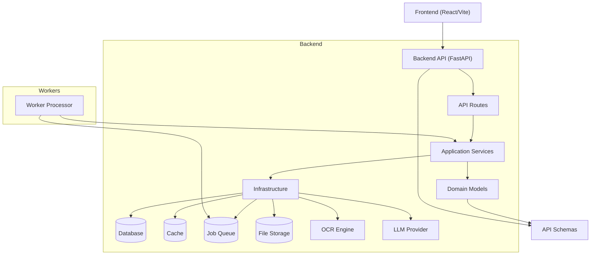

# Lumen

Lumen is a document‑processing system that swallows your PDFs and images, runs OCR + parsing + LLM extraction, and spits out structured results with real‑time status tracking. The codebase is cleanly split: a FastAPI backend with async workers on one side, a Vite/React frontend on the other.

## Architecture 

## What lives where

- **API boundary**: Request validation and response shaping happens in [backend/app/api/routes](backend/app/api/routes). This is where the outside world meets your code.
- **Application services**: Core orchestration—job lifecycle, parsing, OCR, LLM calls, storage—lives in [backend/app/services](backend/app/services).
- **Domain models**: Data structures for jobs and results are defined in [backend/app/models](backend/app/models).
- **Infrastructure**: Database, cache, queue, and storage adapters are tucked into [backend/app/db](backend/app/db) and [backend/app/services](backend/app/services).
- **Frontend flow**: The upload → processing → result journey unfolds across [frontend/src/pages](frontend/src/pages).

## Technical details

### Backend stack

- **Framework**: FastAPI + Uvicorn ([backend/requirements.txt](backend/requirements.txt))
- **Data validation**: Pydantic v2 schemas in [backend/app/models/schemas.py](backend/app/models/schemas.py)
- **Database**: SQLAlchemy with SQLite by default (swap via `DATABASE_URL`)
- **Cache/Queue**: Redis for job queueing and result caching
- **Storage**: S3 by default (configurable storage adapters)
- **OCR**: Tesseract with PDF/image helpers (`pytesseract`, `pdf2image`, `pdfplumber`, `Pillow`)
- **LLM**: OpenAI SDK with retry/backoff controls
- **Scheduler**: APScheduler for periodic cleanup tasks

### Backend endpoints

- `POST /upload` (API key required): Accepts PDF/JPEG/PNG up to 10 MB, queues a job
- `GET /status/{job_id}` (API key required): Job progress and current stage
- `GET /result/{job_id}`: Final structured result (cache‑first)
- `GET /health`: Liveness check
- `POST /admin/cleanup` (admin token): Trigger cleanup

### Worker pipeline

The worker pulls jobs from the queue and marches through five stages:

1. Download from storage
2. OCR to extract raw text
3. Parse medical entities
4. Generate explanation with LLM
5. Sanitize and persist results (DB + cache)

### Frontend stack

- **Framework**: React 18 + Vite + TypeScript ([frontend/package.json](frontend/package.json))
- **Routing**: React Router
- **UI**: Tailwind CSS
- **API client**: Axios wrapper in [frontend/src/api](frontend/src/api)

### Configuration highlights

- **Security**: API key required for upload/status (`REQUIRE_API_KEY`)
- **File constraints**: Size limit and extension validation
- **LLM**: Model, temperature, retries, timeout
- **Storage**: S3 bucket + region or local path
- **Rate limiting**: Per‑minute limit in settings

## Core flow (conceptual)

1. Client uploads a file via the API
2. API creates a job and enqueues work
3. Worker pulls the job, runs OCR + parsing + LLM extraction
4. Results are stored and returned to the client via status/result endpoints

## Key directories

- [backend/app](backend/app)
- [backend/app/api/routes](backend/app/api/routes)
- [backend/app/services](backend/app/services)
- [backend/app/models](backend/app/models)
- [frontend/src](frontend/src)
- [frontend/src/pages](frontend/src/pages)

## Navigating the codebase

Start at the API routes to see request/response contracts. Trace route handlers into services to understand orchestration. Check models/schemas to grasp the data shapes. Review the worker processor to see asynchronous execution in action. Follow the frontend pages to understand the user journey.