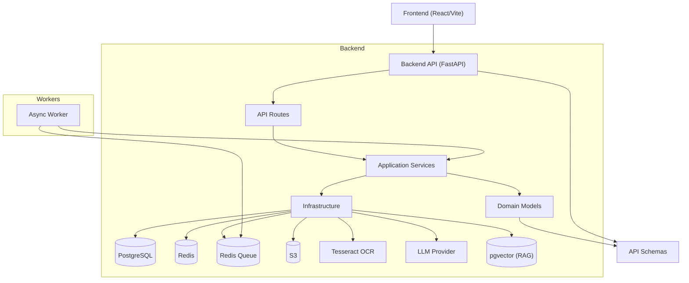

# Lumen

Lumen is a medical document explainer. Upload a blood report or prescription (PDF/image), and it runs OCR → entity parsing → LLM analysis → structured result with plain-English explanations. Built as a FastAPI backend with async workers and a React/Vite frontend.

## Architecture


```mermaid
flowchart TB
    UI["Frontend (React/Vite)"] --> API["Backend API (FastAPI)"]

    subgraph Backend
        API --> Routes["API Routes"]
        Routes --> Services["Application Services"]
        Services --> Domain["Domain Models"]
        Services --> Infra["Infrastructure"]

        Infra --> DB[("PostgreSQL")]
        Infra --> Cache[("Redis")]
        Infra --> Queue[("Redis Queue")]
        Infra --> Storage[("S3")]
        Infra --> OCR["Tesseract OCR"]
        Infra --> LLM["LLM Provider"]
        Infra --> VDB[("pgvector (RAG)")]
    end

    subgraph Workers
        Worker["Async Worker"] --> Queue
        Worker --> Services
    end

    Domain --> Schemas["API Schemas"]
    API --> Schemas
```

## What lives where

- **API routes** — request validation and response shaping: [backend/app/api/routes](backend/app/api/routes)
- **Services** — OCR, parsing, LLM, RAG, storage, cache, job lifecycle: [backend/app/services](backend/app/services)
- **LLM providers** — pluggable Groq / OpenAI / Llama backends: [backend/app/services/llm_providers](backend/app/services/llm_providers)
- **Medical catalogs** — ~100 lab tests, 494 drugs (from RxNorm), synonyms, units: [backend/app/catalog](backend/app/catalog)
- **Domain models** — job and result ORM + Pydantic schemas: [backend/app/models](backend/app/models)
- **Ingestion scripts** — RxNorm drug pull, LOINC test import, pgvector indexer: [backend/scripts](backend/scripts)
- **Frontend pages** — upload → processing → result flow: [frontend/src/pages](frontend/src/pages)

## Technical details

### Backend stack

- **Framework**: FastAPI + Uvicorn
- **Database**: PostgreSQL via SQLAlchemy + Alembic migrations
- **Cache / Queue**: Redis (result cache + BRPOP job queue with DB-poll fallback)
- **Storage**: AWS S3 (`STORAGE_TYPE=s3`)
- **OCR**: Tesseract — native PDF text extraction first, image OCR fallback (`pytesseract`, `pdfplumber`, `pdf2image`, `Pillow`)
- **LLM**: Pluggable provider layer — Groq (default), OpenAI, or local Llama/Ollama. Dual-model routing (heavy/light), retry with exponential backoff
- **RAG**: pgvector (PostgreSQL extension) + Jina AI embeddings (`jina-embeddings-v3`, 512 dims) — disabled by default; enable after running `python scripts/index_catalogs.py`
- **Scheduler**: APScheduler — periodic job expiry and file cleanup

### Docker services

Five containers managed by `docker-compose.yml`:

| Container | Image | Port |
|---|---|---|
| `lumen-api` | custom (FastAPI) | 8000 |
| `lumen-worker` | custom (async worker) | — |
| `lumen-ui` | custom (nginx/React) | 3000 |
| `lumen-postgres` | pgvector/pgvector:pg15 | — |
| `lumen-redis` | redis:7-alpine | — |

### API endpoints

| Method | Path | Auth | Description |
|---|---|---|---|
| `POST` | `/upload` | API key | Accept PDF/JPEG/PNG ≤10 MB, create and queue a job |
| `GET` | `/status/{job_id}` | API key | Job progress and current stage |
| `GET` | `/result/{job_id}` | API key | Final structured result (cache-first) |
| `GET` | `/health` | — | Liveness check |
| `POST` | `/admin/cleanup` | Admin token | Trigger job expiry and file cleanup |

### Worker pipeline

```
Download (S3) → OCR → Parse entities → RAG retrieval → LLM explanation → Sanitize → Store (DB + Redis)
```

- CPU-bound steps (OCR, parsing) run in a `ThreadPoolExecutor`
- LLM call is fully async
- Up to `WORKER_CONCURRENCY` jobs run concurrently (default: 4)
- Startup watchdog re-queues jobs stuck in `processing` (crash recovery)
- DB-poll loop catches jobs that never reached Redis

### Medical catalogs

- **Tests**: ~100 lab tests across CBC, LFT, KFT, lipid, thyroid, diabetes, cardiac, hormones, vitamins, tumour markers, autoimmune, infectious panels — with reference ranges and clinical metadata
- **Medicines**: 494 drugs pulled from RxNorm (60 ATC classes) with Indian brand name mappings
- **Synonyms / Units**: auto-generated normalisation maps (1 468 synonyms, 75 unit mappings)

To regenerate from source APIs:
```bash
cd backend
python scripts/ingest_rxnorm.py          # pull drugs from RxNorm
python scripts/build_catalogs.py --synonyms --units
python scripts/index_catalogs.py         # embed + index into pgvector
```

### Frontend stack

- **Framework**: React 18 + Vite + TypeScript
- **UI**: Tailwind CSS
- **Routing**: React Router
- **API client**: Axios wrapper in [frontend/src/api](frontend/src/api)

## Configuration

Copy `backend/.env.example` to `backend/.env` and fill in the required values:

```bash
cp backend/.env.example backend/.env
```

Key variables:

| Variable | Description |
|---|---|
| `LLM_PROVIDER` | `groq` (default) \| `openai` \| `llama` |
| `GROQ_API_KEY` | Required when `LLM_PROVIDER=groq` |
| `OPENAI_API_KEY` | Required when `LLM_PROVIDER=openai` |
| `S3_BUCKET` / `AWS_*` | Required when `STORAGE_TYPE=s3` |
| `RAG_ENABLED` | `false` (default) — set `true` after indexing |
| `JINA_API_KEY` | Required when `RAG_ENABLED=true` |
| `REQUIRE_API_KEY` | Enforce `X-API-Key` header on all routes |

## Running locally

```bash
docker compose up -d
```

All five containers start automatically. The API is available at `http://localhost:8000`, the UI at `http://localhost:3000`.

## Navigating the codebase

1. **API contract** — start at [backend/app/api/routes](backend/app/api/routes) for request/response shapes
2. **Job execution** — trace into [backend/app/workers/processor.py](backend/app/workers/processor.py) for the full pipeline
3. **LLM logic** — see [backend/app/services/llm_providers](backend/app/services/llm_providers) for provider abstraction and prompts
4. **Data shapes** — [backend/app/models/schemas.py](backend/app/models/schemas.py) for all Pydantic models
5. **Frontend flow** — [frontend/src/pages](frontend/src/pages): `UploadPage → ProcessingPage → ResultPage`