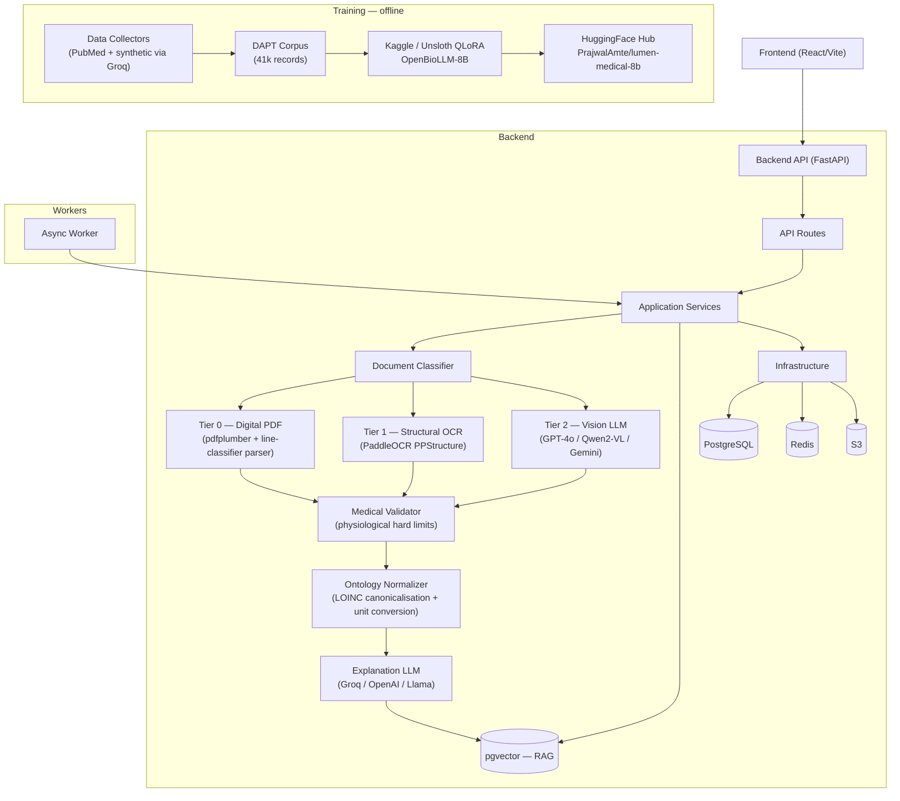

# Lumen

Lumen is a medical document explainer. Upload a blood report or prescription (PDF/image), and it runs OCR → entity parsing → LLM analysis → structured result with plain-English explanations. Built as a FastAPI backend with async workers and a React/Vite frontend.

## Architecture


```mermaid
flowchart TB
    UI["Frontend (React/Vite)"] --> API["Backend API (FastAPI)"]

    subgraph Backend
        API --> Routes["API Routes"]
        Routes --> Services["Application Services"]

        Services --> Classifier["Document Classifier"]
        Classifier --> Tier0["Tier 0 — Digital PDF<br/>(pdfplumber + line-classifier parser)"]
        Classifier --> Tier1["Tier 1 — Structural OCR<br/>(PaddleOCR PPStructure)"]
        Classifier --> Tier2["Tier 2 — Vision LLM<br/>(GPT-4o / Qwen2-VL / Gemini)"]

        Tier0 --> Validator["Medical Validator<br/>(physiological hard limits)"]
        Tier1 --> Validator
        Tier2 --> Validator

        Validator --> Ontology["Ontology Normalizer<br/>(LOINC canonicalisation + unit conversion)"]
        Ontology --> ExplainLLM["Explanation LLM<br/>(Groq / OpenAI / Llama)"]

        Services --> RAG[("pgvector — RAG")]
        ExplainLLM --> RAG

        Services --> Infra["Infrastructure"]
        Infra --> DB[("PostgreSQL")]
        Infra --> Cache[("Redis")]
        Infra --> Storage[("S3")]
    end

    subgraph Workers
        Worker["Async Worker"] --> Services
    end

    subgraph Training ["Training — offline"]
        Collectors["Data Collectors<br/>(PubMed + synthetic via Groq)"] --> Corpus["DAPT Corpus<br/>(41k records)"]
        Corpus --> Finetune["Kaggle / Unsloth QLoRA<br/>OpenBioLLM-8B"]
        Finetune --> HFHub["HuggingFace Hub<br/>PrajwalAmte/lumen-medical-8b"]
    end
```

## What lives where

- **API routes** — request validation and response shaping: [backend/app/api/routes](backend/app/api/routes)
- **Services** — OCR, parsing, LLM, RAG, storage, cache, job lifecycle: [backend/app/services](backend/app/services)
- **Document classifier** — selects extraction tier (digital / structural / vision): [backend/app/services/document_classifier.py](backend/app/services/document_classifier.py)
- **Structural OCR** — PaddleOCR PPStructure table extraction for scanned reports: [backend/app/services/structural_ocr.py](backend/app/services/structural_ocr.py)
- **Medical validator** — physiological hard limits, unit coherence, inter-test consistency: [backend/app/services/medical_validator.py](backend/app/services/medical_validator.py)
- **Ontology normalizer** — LOINC canonical IDs, synonym resolution, unit conversion: [backend/app/services/ontology.py](backend/app/services/ontology.py)
- **LLM providers** — pluggable Groq / OpenAI / Llama explanation backends: [backend/app/services/llm_providers](backend/app/services/llm_providers)
- **Vision providers** — pluggable GPT-4o / Gemini / local Qwen2-VL extraction backends: [backend/app/services/vision_providers](backend/app/services/vision_providers)
- **Extraction model** — intermediate representation (`ExtractedValue`, `ExtractionResult`, `PageContent`): [backend/app/models/extraction.py](backend/app/models/extraction.py)
- **Medical catalogs** — expanded lab test panels, 494 drugs (from RxNorm), synonyms, units: [backend/app/catalog](backend/app/catalog)
- **Domain models** — job and result ORM + Pydantic schemas: [backend/app/models](backend/app/models)
- **Ingestion scripts** — RxNorm drug pull, LOINC test import, pgvector indexer: [backend/scripts](backend/scripts)
- **Frontend pages** — upload → processing → result flow: [frontend/src/pages](frontend/src/pages)
- **Training module** — data collection and fine-tuning for OpenBioLLM-8B: [training/](training/)

## Technical details

### Backend stack

- **Framework**: FastAPI + Uvicorn
- **Database**: PostgreSQL via SQLAlchemy + Alembic migrations
- **Cache / Queue**: Redis (result cache + BRPOP job queue with DB-poll fallback)
- **Storage**: AWS S3 (`STORAGE_TYPE=s3`)
- **OCR — 4-tier pipeline**: (1) pdfplumber native text for digital PDFs → (2) PaddleOCR PPStructure for clean scanned tables → (3) Tesseract PSM-3 fallback → (4) Vision LLM (GPT-4o / Gemini / Qwen2-VL) for degraded or multi-modal pages (`pytesseract`, `pdfplumber`, `pdf2image`, `paddleocr`, `Pillow`)
- **Extraction pipeline**: `DocumentClassifier` routes each document to the right tier; `MedicalValidator` rejects physiologically impossible values; `OntologyNormalizer` maps all names to canonical LOINC IDs and converts units before anything reaches the LLM
- **LLM — explanation only**: The LLM never sees raw OCR text. It receives a validated, structured `ExtractionResult` and explains it. Provider layer is pluggable — Groq (default), OpenAI, or local Llama/Ollama
- **Vision providers**: Pluggable tier for complex/degraded pages — OpenAI (`gpt-4o`), Gemini (`gemini-1.5-flash`), or local Ollama (`qwen2-vl:7b`). Section-aware prompts per page type (lab table, ECG, echo, demographics)
- **RAG**: pgvector (PostgreSQL extension) + Jina AI embeddings (`jina-embeddings-v3`, 512 dims) — disabled by default; enable after running `python scripts/index_catalogs.py`
- **Scheduler**: APScheduler — periodic job expiry and file cleanup

### Docker services

Five containers managed by `docker-compose.yml`:

| Container | Image | Port |
|---|---|---|
| `lumen-api` | custom (FastAPI) | 8000 |
| `lumen-worker` | custom (async worker) | — |
| `lumen-ui` | custom (nginx/React) | 3000 |
| `lumen-postgres` | pgvector/pgvector:pg15 | — |
| `lumen-redis` | redis:7-alpine | — |

### API endpoints

| Method | Path | Auth | Description |
|---|---|---|---|
| `POST` | `/upload` | API key | Accept PDF/JPEG/PNG ≤10 MB, create and queue a job |
| `GET` | `/status/{job_id}` | API key | Job progress and current stage |
| `GET` | `/result/{job_id}` | API key | Final structured result (cache-first) |
| `GET` | `/health` | — | Liveness check |
| `POST` | `/admin/cleanup` | Admin token | Trigger job expiry and file cleanup |

### Worker pipeline

```
1. Download (S3)
2. Classify document  →  DocumentProfile (tier, sections, scan quality)
3. Extract (tier-routed)
   └── Tier 0: pdfplumber + line-classifier parser
   └── Tier 1: PaddleOCR PPStructure → cell mapping
   └── Tier 2: Vision LLM with section-aware prompts
4. Validate            →  MedicalValidator (hard limits, unit coherence, inter-test logic)
5. Normalize           →  OntologyNormalizer (canonical IDs, unit conversion, ref-range unification)
6. RAG retrieval       →  pgvector nearest-neighbour search
7. Explain             →  LLM receives ExtractionResult JSON, not raw text
8. Sanitize + Store    →  result_sanitizer → DB + Redis
```

- CPU-bound steps (OCR, parsing, validation) run in a `ThreadPoolExecutor`
- LLM call is fully async
- Up to `WORKER_CONCURRENCY` jobs run concurrently (default: 4)
- Startup watchdog re-queues jobs stuck in `processing` (crash recovery)
- DB-poll loop catches jobs that never reached Redis
- Rejected values (failed hard limits) go to `extraction_artifacts` in the result — visible to the user, not silently discarded

### Medical catalogs

- **Tests**: Comprehensively expanded lab test coverage across CBC, LFT, KFT, lipid, thyroid, diabetes, cardiac, hormones, vitamins, tumour markers, autoimmune, coagulation, infectious disease, and specialist panels — with reference ranges, LOINC mappings, and clinical metadata
- **Medicines**: 494 drugs pulled from RxNorm (60 ATC classes) with Indian brand name mappings
- **Synonyms / Units**: auto-generated normalisation maps (1 468 synonyms, 75 unit mappings)
- **Ontology**: LOINC-aligned canonical IDs used by the normalizer for deterministic test resolution

To regenerate from source APIs:
```bash
cd backend
python scripts/ingest_rxnorm.py          # pull drugs from RxNorm
python scripts/build_catalogs.py --synonyms --units
python scripts/index_catalogs.py         # embed + index into pgvector
```

### Frontend stack

- **Framework**: React 18 + Vite + TypeScript
- **UI**: Tailwind CSS
- **Routing**: React Router
- **API client**: Axios wrapper in [frontend/src/api](frontend/src/api)

---

## Training module

Lumen fine-tunes `aaditya/Llama3-OpenBioLLM-8B` as the explanation model. The training module is entirely offline — it does not affect the running API. Fine-tuned checkpoints are published to `PrajwalAmte/lumen-medical-8b` on HuggingFace Hub and can be loaded as a drop-in Llama provider.

### Two-phase training

**Phase 1 — DAPT (Domain-Adaptive Pre-Training)**
The base model is continued pre-trained on a 41,218-record corpus of Indian medical domain text to shift the token distribution toward clinical vocabulary before task-specific training.

Corpus sources:
- PubMed abstracts filtered for Indian epidemiology (diabetes, anaemia, tuberculosis, cardiovascular disease)
- RxNorm drug descriptions canonicalised to Indian brand names and dosage forms
- Synthetic lab reports generated by `llama-3.1-8b-instant` via Groq API, simulating Indian pathology report formatting

**Phase 2 — SFT (Supervised Fine-Tuning)**
The DAPT checkpoint is fine-tuned on input/output pairs where the input is a structured `ExtractionResult` JSON (representing validated lab values) and the output is a plain-language explanation in Indian English.

SFT pairs are generated by a 3-call Groq pipeline per record:
1. Simulate an OCR extraction (raw report text)
2. Produce the structured extraction (what the deterministic pipeline would output)
3. Generate the explanation (what the fine-tuned model must learn to produce)

### Training infrastructure

- **Model**: `aaditya/Llama3-OpenBioLLM-8B` (Apache 2.0)
- **Method**: QLoRA via Unsloth (4-bit quantisation, LoRA rank 16, alpha 32)
- **Hardware**: Kaggle T4 x2 (free tier)
- **Notebook**: [training/lumen_finetune.ipynb](training/lumen_finetune.ipynb)
- **Checkpointing**: HuggingFace Hub every 50 steps (`hub_strategy="checkpoint"`)

### Data collection

```bash
cd training

# Collect PubMed abstracts (no API key needed)
python collect_all.py --pubmed

# Collect drug descriptions (no API key needed)
python collect_all.py --drugs

# Generate synthetic reports + SFT pairs (Groq free tier: ~120/day)
python collect_all.py --synthetic --count 120 --groq-key gsk_YOUR_KEY

# Deduplicate and build final DAPT corpus
python collect_all.py --deduplicate
```

Large data files (`training/data/`) are gitignored. The notebook and collectors are version-controlled.

## Configuration

Copy `backend/.env.example` to `backend/.env` and fill in the required values:

```bash
cp backend/.env.example backend/.env
```

Key variables:

| Variable | Description |
|---|---|
| `LLM_PROVIDER` | `groq` (default) \| `openai` \| `llama` |
| `GROQ_API_KEY` | Required when `LLM_PROVIDER=groq` |
| `OPENAI_API_KEY` | Required when `LLM_PROVIDER=openai` |
| `S3_BUCKET` / `AWS_*` | Required when `STORAGE_TYPE=s3` |
| `STORAGE_TYPE` | `local` (default for dev) \| `s3` |
| `RAG_ENABLED` | `false` (default) — set `true` after indexing |
| `JINA_API_KEY` | Required when `RAG_ENABLED=true` |
| `REQUIRE_API_KEY` | Enforce `X-API-Key` header on all routes |
| `ADMIN_TOKEN` | Separate token for `/admin/cleanup` (not the user API key) |
| `VISION_PROVIDER` | `openai` \| `gemini` \| `local` — activates Tier 2 extraction |
| `VISION_API_KEY` | API key for cloud vision provider |
| `VISION_ENDPOINT` | Ollama endpoint when `VISION_PROVIDER=local` (e.g. `http://localhost:11434`) |
| `VISION_MODEL` | Vision model name (e.g. `gpt-4o`, `gemini-1.5-flash`, `qwen2-vl:7b`) |

## Running locally

```bash
docker compose up -d
```

All five containers start automatically. The API is available at `http://localhost:8000`, the UI at `http://localhost:3000`.

## Navigating the codebase

1. **API contract** — start at [backend/app/api/routes](backend/app/api/routes) for request/response shapes
2. **Job execution** — trace into [backend/app/workers/processor.py](backend/app/workers/processor.py) for the full 8-stage pipeline
3. **Extraction model** — [backend/app/models/extraction.py](backend/app/models/extraction.py) is the intermediate representation that connects all pipeline stages
4. **Tier routing** — [backend/app/services/document_classifier.py](backend/app/services/document_classifier.py) decides which extraction path each document takes
5. **Validation rules** — [backend/app/services/medical_validator.py](backend/app/services/medical_validator.py) for hard limits and inter-test logic
6. **LLM logic** — [backend/app/services/llm_providers](backend/app/services/llm_providers) for provider abstraction and explanation-only prompts
7. **Vision logic** — [backend/app/services/vision_providers](backend/app/services/vision_providers) for vision tier provider abstraction
8. **Data shapes** — [backend/app/models/schemas.py](backend/app/models/schemas.py) for all Pydantic models
9. **Frontend flow** — [frontend/src/pages](frontend/src/pages): `UploadPage → ProcessingPage → ResultPage`
10. **Fine-tuning** — [training/](training/) for data collection scripts and the Kaggle training notebook